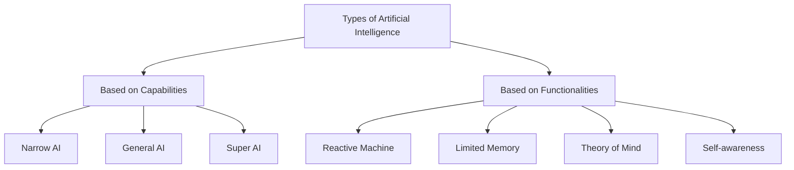

## AI Categories

### Genetic AI (GenAI)

- Generate new data
- Black-box like in nature
- Example: Writing emails, blogs, reports, creating rudimentary content

### Explainable AI (XAI)

- Decisions understandable to humans
- Unlike black box nature, XAI provides rationale for its outputs
- Example: Explaining why an AI diagnosed a disease, **prevent bias** in recruitment shortlisting

### Hybrid AI

- Combines rule-based AI with data-driven AI
- Balances reasoning with learning
- Example: Autonomous systems (rules-computer vision based)

### Adaptive AI

- Adjusts in real-time
- Example: Real-time cybersecurity systems

### Conversational AI

- Human-like conversations
- Example: Customer support chatbots

### Affective AI (Emotional AI)

- Responds to human emotions using facial expression, voice tone or text sentiment.
- Example: Call centers detect frustration or satisfaction

### Ethical AI/Responsible AI

- Transparent, fair and safe, respects privacy
- Example: Fair credit scoring systems

### Quantum AI

- Quantum computing to enhance AI performance for very complex problems
- Example: Drug discovery solutions, Quantum based ML

## Types of AI

### Based on Capability

- Weak AI
- Strong AI
	- exhibits human intelligence, able to learn and understand in indistinguishable ways
	- Can think, strategize, and perform multiple tasks
	- Integrate prior knowledge
- Artificial Super Intelligence
	- Hypothetical AI that surpasses that of the brightest human Hypothetical AI that surpasses that of the brightest human
	- Greater problem solving and decision making Greater problem solving and decision making
	- Capability to think, to reason, to make judgments, plan, and learn Capability to think, to reason, to make judgments, plan, and learn

### Based on functionality

- Reactive Machine
	- Most fundamental type of AI
	- Can respond to immediate requests and tasks, aren't capable of storing memory or learning from past experiences
- Limited memory
	- Trains from past data
- Theory of Mind
	- Describes human ability o read the emotions of others and predict future actions
	- Example: An AI that can negotiate, cooperate and even lie on behalf of you
- Self Aware
	- Exists hypothetically
	- Will be smarter than human mind
	- Emotions needs and beliefs of its own
