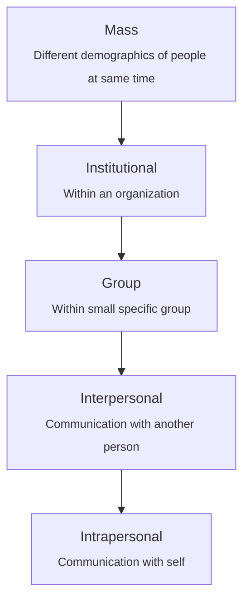

## Necessity of communication

(elaborate on each)

- Sharing our thoughts
- Communicating ideas
- Absorbing new information
- Being entertained
- Persuading someone

## Aspects of communication

- Media
- Political
- Social
- and so on…

## Levels of communication

## Important Question Given

- Need vs Importance of communication
