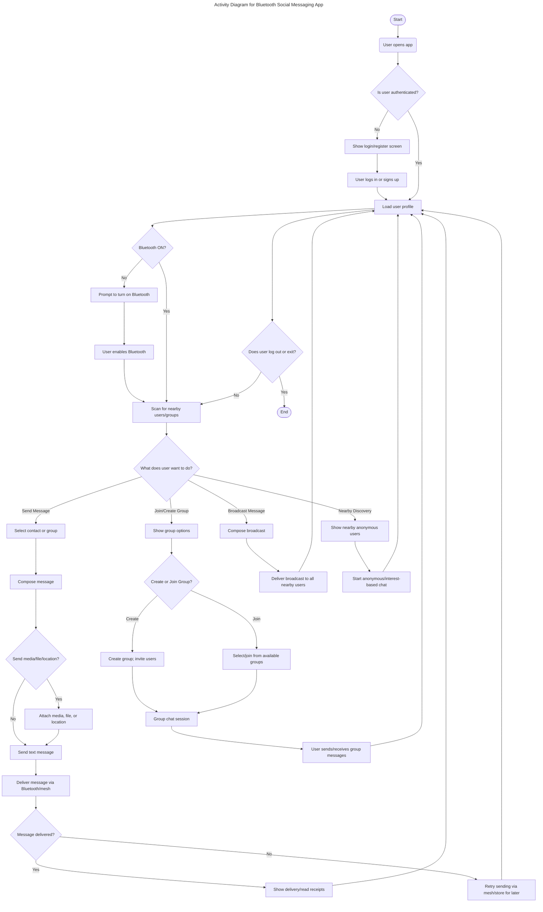

## By K036 and K005

```mermaid
---
title: Activity Diagram for Bluetooth Social Messaging App
---
flowchart TD
    A([Start]) --> B(User opens app)
    B --> C{Is user authenticated?}
    C -- No --> D[Show login/register screen]
    D --> E[User logs in or signs up]
    E --> F[Load user profile]
    C -- Yes --> F[Load user profile]
    F --> G{Bluetooth ON?}
    G -- No --> H[Prompt to turn on Bluetooth]
    H --> I[User enables Bluetooth]
    I --> J[Scan for nearby users/groups]
    G -- Yes --> J[Scan for nearby users/groups]
    J --> K{What does user want to do?}
    K -- "Send Message" --> L[Select contact or group]
    K -- "Join/Create Group" --> M[Show group options]
    K -- "Broadcast Message" --> N[Compose broadcast]
    K -- "Nearby Discovery" --> O[Show nearby anonymous users]
    L --> P[Compose message]
    P --> Q{Send media/file/location?}
    Q -- No --> R[Send text message]
    R --> S[Deliver message via Bluetooth/mesh]
    Q -- Yes --> T[Attach media, file, or location]
    T --> R
    S --> U{Message delivered?}
    U -- Yes --> V[Show delivery/read receipts]
    U -- No --> W[Retry sending via mesh/store for later]
    M --> X{Create or Join Group?}
    X -- Create --> Y[Create group; invite users]
    X -- Join --> Z[Select/join from available groups]
    Y --> AA[Group chat session]
    Z --> AA
    AA --> AB[User sends/receives group messages]
    N --> AC[Deliver broadcast to all nearby users]
    O --> AD[Start anonymous/interest-based chat]
    AB --> F
    AC --> F
    AD --> F
    V --> F
    W --> F
    F --> AE{Does user log out or exit?}
    AE -- Yes --> AF([End])
    AE -- No --> J
```

