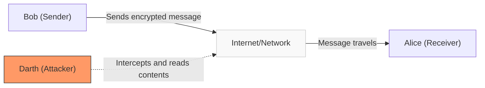
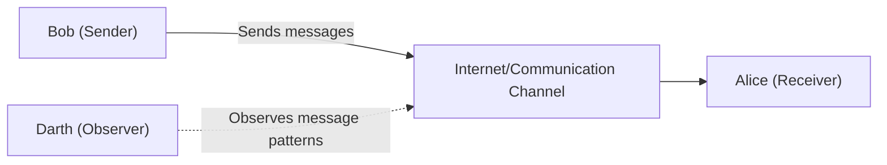

## Passive

### Release message content

### Traffic analysis

## Active Attack

### Masquerade

### Replay

## Active v/s Passive Attacks

| **Aspect** | **Passive Attacks**                          | **Active Attacks**                           |
| ---------- | -------------------------------------------- | -------------------------------------------- |
| Nature     | Monitoring and eavesdropping                 | Modification and disruption                  |
| Detection  | Difficult to detect                          | Often detectable                             |
| Examples   | Traffic analysis, release of message content | Masquerade, replay, modification of messages |
| Impact     | Threatens confidentiality                    | Threatens integrity and availability         |
| Prevention | Encryption, secure channels                  | Authentication, message integrity checks     |

