## Public Key Cryptosystem

---

## Access Control

- InfoSec process which enables organizations to manage who is authorized to access data and resources

---

## To achieve data integrity (example of violation)

```mermaid
sequenceDiagram
    participant Alice as Alice
    participant Oscar as Oscar (Hacker)
    participant Bob as Bob
    
    Note over Alice: Creates message M
    Note over Alice: Calculates checksum C(M)
    Alice->>Oscar: Sends M and C(M)
    Note over Oscar: Intercepts message
    Note over Oscar: Attempts to modify M to M'
    Oscar->>Bob: Forwards modified M' and original C(M)
    Note over Bob: Calculates checksum C(M')
    Note over Bob: Compares C(M') with received C(M)
    Note over Bob: C(M') ≠ C(M), integrity violation detected
```

---

## Traffic Padding

- Insert some bogus data into traffic data
- Avoids traffic analysis attack

---

## Routing Control

- Selecting and continuously changing available routes between sender and receiver
- Prevents eavesdropping

---

## Authentication Exchange

- Entities exchange some message to prove identity to each other
- **Nonce: A time varying-random number with one-time-usage**

---

## Notarization

- The use of a trusted third-party to assure certain properties of a data exchange

---

## Pervasive Security Mechanisms

Mechanisms not specific to an particular OSI service or similar protocol layers

- Trusted Functionality
	- Example: As established by a security policy
- Security Label
	- Marking bound to a resource (may be a data unit)
- Event Detection
	- Detection of security relevant events
- Security Audit Trail
- Security Recovery

---

