## Activity

- Develop an attack tree for gaining access to a customer account details from the database of a bank

### Attack Tree: Gaining Access to Customer Account Details from a Bank Database

```mermaid
graph TD
    A["Goal: Access Customer Account Details"] --> B["Direct Database Access"]
    A --> C["Social Engineering"]
    A --> D["Network Intrusion"]
    A --> E["Application Vulnerabilities"]
    A --> F["Physical Access"]
    
    B --> B1["SQL Injection"]
    B --> B2["Exploit Database Vulnerabilities"]
    B --> B3["Obtain Database Credentials"]
    B3 --> B3a["Brute Force Attack"]
    B3 --> B3b["Credential Stuffing"]
    B3 --> B3c["Steal Credentials from Employees"]
    
    C --> C1["Phishing Attacks"]
    C1 --> C1a["Email Phishing"]
    C1 --> C1b["Voice Phishing (Vishing)"]
    C1 --> C1c["SMS Phishing (Smishing)"]
    C --> C2["Pretexting"]
    C --> C3["Impersonation"]
    C3 --> C3a["Customer Impersonation"]
    C3 --> C3b["Employee Impersonation"]
    
    D --> D1["Man-in-the-Middle Attack"]
    D --> D2["Network Sniffing"]
    D --> D3["Exploit Firewall Vulnerabilities"]
    D --> D4["Compromise VPN"]
    
    E --> E1["Cross-Site Scripting (XSS)"]
    E --> E2["Cross-Site Request Forgery (CSRF)"]
    E --> E3["API Vulnerabilities"]
    E --> E4["Session Hijacking"]
    
    F --> F1["Gain Physical Access to Server Room"]
    F --> F2["Install Keyloggers"]
    F --> F3["Shoulder Surfing"]
    F --> F4["Dumpster Diving"]
    F --> F5["Theft of Physical Media"]

```

